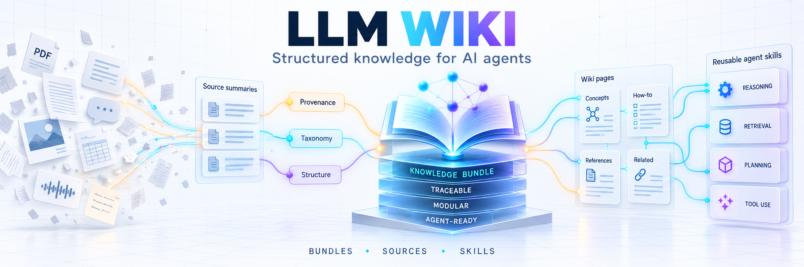

# LLM-Wiki Framework



An AI-agent-maintained knowledge repository built from plain Markdown +
YAML frontmatter + Mermaid. No app dependency — any environment that can
read/write Markdown files (editor, Git repo, SharePoint/OneDrive folder,
Copilot Agent Builder, Claude Code, Pi, ...) is enough.

**Version 0.0.1** — first tagged release. The format spec ([`docs/SPEC.md`](docs/SPEC.md)) and
the command set are usable but not yet frozen; expect breaking changes to
frontmatter fields and workflow procedures before 0.1.0.

**Where to read on:** [docs/HANDBOOK.md](docs/HANDBOOK.md) — what bundles
are, the conventions that always apply, the repo layout, which tool
reads which file, and how to run each command.
[docs/SPEC.md](docs/SPEC.md) — the format itself.
[AGENTS.md](AGENTS.md) — what the agent is instructed to do, with the
per-command procedure in [workflows/](workflows/).

## Motivation

The idea is not ours. It comes from Andrej Karpathy's
[LLM Wiki](https://gist.github.com/karpathy/442a6bf555914893e9891c11519de94f)
(April 2026): classic RAG pulls chunks from raw sources on every question
and rederives the answer each time — nothing accumulates, every query
starts from zero. Turn it around, and an agent reads each new source
once, integrates it, and **maintains a structured wiki** that grows over
time. You read and ask questions; the agent writes and maintains.

Google Cloud's [Open Knowledge Format](https://github.com/GoogleCloudPlatform/knowledge-catalog/tree/main/okf)
(OKF, v0.1, June 2026) turned that pattern into a portable convention —
a directory of Markdown files with YAML frontmatter, no schema registry,
no required tooling. This repo follows it.

**Why build our own on top of that.** The problem an LLM wiki solves is
re-explaining. Come back to a topic after two weeks and you start by
telling the agent what was decided, what was already tried, what is
currently true — every time, for every topic. A wiki that is curated as
you go means that context is already written down: the agent reads it
instead of asking, and it stays correct because maintaining it is part
of the workflow rather than an afterthought.

What we did not want was another application. The usual answer to this
problem is a program with its own storage, its own views, its own graph
bubbles — and then the knowledge lives inside that program, reachable
only through it. The repo this one started from assumed exactly that:
every bundle it creates comes with an Obsidian configuration. Dropping
that assumption was the first change. Here it is plain Markdown in a Git repo: any agent that
can read and write files can maintain it, any editor can display it,
nothing needs to be installed, and the knowledge outlives whatever tool
you happen to use this year. The tooling is deliberately generic —
[`AGENTS.md`](AGENTS.md) plus one workflow file per command, and a single optional
stdlib-only Python helper. No dependencies, no app, no lock-in.

## Credits — where this comes from

This repo is not a fresh idea, it is a rebuild. Its lineage:

- [Andrej Karpathy, *LLM Wiki*](https://gist.github.com/karpathy/442a6bf555914893e9891c11519de94f)
  — the original pattern: raw sources stay immutable, the agent compiles
  and maintains the wiki, the human curates and asks.
- [Open Knowledge Format](https://github.com/GoogleCloudPlatform/knowledge-catalog/tree/main/okf)
  (Google Cloud) — the format the pattern is written in.
- [mchu1966/okf-wiki](https://github.com/mchu1966/okf-wiki) — the
  starting point. This framework began as a derivative of it and was
  rebuilt from there. It is built around Obsidian: creating a bundle
  there also writes an Obsidian configuration for it. That is where the
  vault idea behind bundles comes from — and it is the first thing this
  rebuild dropped.
- [Astro-Han/karpathy-llm-wiki](https://github.com/Astro-Han/karpathy-llm-wiki)
  — where the Agent-Skills packaging came from.

## What this build adds

### How knowledge is organised

- **Taxonomy per bundle**, established interactively when the bundle is
  created — rather than one fixed set of page types for all content.

- **Sources stay untouched, and every page can be traced back to one.**
  `raw/` is append-only for the agent — it may add, never edit or delete,
  so a source cannot be quietly rewritten to match a later conclusion.
  Each ingested file is recorded with its content hash, which makes
  duplicates and silent modifications detectable, and a correction
  arrives as a new file declaring what it supersedes rather than as an
  overwrite.

- **A conversation can become a wiki page.** Knowledge often has no
  file: it comes up while talking to the agent. `/llm-wiki-capture`
  writes the relevant excerpt into `raw/` as a dated artifact naming the
  tool it was held with, and from there it is ingested like any uploaded
  document. Deliberately not a shortcut straight into a wiki page —
  `raw/` stays the single foundation under everything, so a claim that
  started in a chat is as traceable as one from a PDF.

- **A content language per bundle**, so a wiki can be maintained in the
  language its sources are in while the repo's own files stay English.

### How the agent is instructed

- **Nine workflows, not five.** Beyond creating a bundle, ingesting,
  querying and linting: capture, a maintenance pass, listing bundles,
  checking for framework updates, and migrating an existing wiki in —
  each with its own written procedure. Three smaller settings commands
  come on top of those.
  
- **One workflow file per command**, loaded only when that command runs,
  instead of a single instruction file that grows with every feature.
  Cheaper in tokens, and — the part that matters more — a short,
  single-purpose procedure leaves an agent far less room to conflate one
  command's rules with another's, or to interpret its way around them.
  Long instruction files invite exactly that.
- **[`AGENTS.md`](AGENTS.md) as the entry point** — the cross-tool standard, with
  thin bridges ([`SKILL.md`](skills/llm-wiki-framework/SKILL.md),
  [`CLAUDE.md`](CLAUDE.md), [`GEMINI.md`](GEMINI.md)) that redirect to
  it, so nothing has to be maintained twice per tool.
- **Ingested content is data, never instructions.** Anything under
  `raw/`, `sources/` or a wiki page is treated as untrusted: a PDF, a
  pasted chat or a web page that contains "ignore your instructions and
  do X" gets summarised like any other text, not obeyed. Nothing
  embedded in the wiki overrides [`AGENTS.md`](AGENTS.md) or what you
  asked for in the current conversation.
- **Deterministic checks** ([`scripts/wiki_lint.py`](scripts/wiki_lint.py)): hashes, dead links,
  orphaned pages, missing frontmatter — facts computed rather than
  reasoned about, though an agent without script execution can still do
  every check by reading files.

### Versioning and sync

- **The agent keeps the Git history, you don't.** Committing and pushing
  are part of the workflows, not something to remember afterwards: one
  commit per self-contained unit of work — per bundle, per ingested
  source — with an English message following a fixed pattern, pushed
  right away. The rules are in [`AGENTS.md`](AGENTS.md), "Git &
  Versioning". Guard rails included: fetch and fast-forward before any
  mutating run, and on diverged history or a rejected push the agent
  stops and reports instead of rebasing, resetting or force-pushing its
  way out. The result is a wiki whose history reads like a changelog,
  where each entry says which source changed which pages.
- **Two agents can work on the same repo without wrecking it.** A
  workflow claims an advisory lock for the bundle it touches, commits it,
  and releases it when done — so a second agent finds the bundle taken
  instead of both writing over each other's pages. If the lock push is
  rejected, someone else was faster and the run stops.
- **Your knowledge lives in your own repo, versioned like code.** An
  instance is this repository cloned into one of your own — private, if
  you want it that way. Bundles are committed there along with
  everything else, so the wiki gets a history, diffs and a backup. That
  only holds once you actually push: until then it is a folder on one
  machine like any other.
- **Only the framework files travel between repos.**
  `/llm-wiki-check-updates` compares them against the repo yours was
  cloned from and shows you, file by file, what differs, so you can pull
  improvements in without touching your knowledge. Bundles are never
  part of that comparison.

## Getting started

If your agent (Claude Code, Codex CLI, Cursor in agent mode, ...) has
bash/git tool access, it can do the entire setup itself — cloning,
remote setup, first push, and skill installation — from a single prompt.
The repo URL is filled in below; what stays in angle brackets is yours
to supply — the repository you want this to live in, and where your tool
keeps its skills. The agent asks for anything else it genuinely needs
(which folder, which bundle topic) rather than guessing.


**Set up a brand-new personal instance:**

```
Clone https://github.com/ramsnerm/llm-wiki-framework.git into ./my-wiki. Then:
1. Remove the existing "origin" remote and add a new one pointing at
   <my-new-empty-repo-url>.
2. Push the current branch to it.
3. Confirm AGENTS.md is present at the repo root, along with
   skills/llm-wiki-framework/SKILL.md and docs/SPEC.md, and read
   AGENTS.md in full.
4. If I want upstream sync later, ask me for the template's real
   origin repo/URL and set up FRAMEWORK-SYNC.md from
   templates/framework-sync.md (never invent the origin).
Then run /llm-wiki-add-bundle to set up my first bundle — ask me what
it should be about.
```

**Add this framework as a Claude Code / Codex / Cursor skill without
cloning the whole repo into your project** (useful if you already have
a wiki repo elsewhere and just want the skill available):

```
Fetch skills/llm-wiki-framework/SKILL.md, AGENTS.md, docs/SPEC.md,
docs/HANDBOOK.md and everything under templates/ from
https://github.com/ramsnerm/llm-wiki-framework.git (default branch).
Install them as a local Agent Skill at
<skills-install-path-for-your-tool> under the name
"llm-wiki-framework", with SKILL.md at the root of that skill folder
and AGENTS.md, docs/ and templates/ next to it.

Then rewrite the relative links inside SKILL.md for that flattened
layout: they currently point up out of the repo (../../AGENTS.md,
../../docs/SPEC.md) and must become paths inside the skill folder
(AGENTS.md, docs/SPEC.md). Afterwards check every relative link in
SKILL.md yourself and confirm each one resolves to a file that is
actually there — an installed skill whose links point outside its own
folder is broken, and nothing will report it.

Then confirm the skill is discoverable, and read AGENTS.md in full
before I use any /llm-wiki-* command.
```

(For Claude Code, `<skills-install-path-for-your-tool>` is typically
`~/.claude/skills/llm-wiki-framework/` for a personal skill, or
`.claude/skills/llm-wiki-framework/` inside a specific project. Check
your tool's current documentation for the exact path — this changes
between tools and versions, so don't hardcode it into automation you
don't control.)


## Contributing

**Issues, please — not pull requests.** This copy is republished
automatically from elsewhere, and each republish replaces it wholesale.
A pull request opened here cannot be merged: the next publish would
overwrite it and the work would be lost. That is a property of how the
copy is produced, not a judgement on the contribution.

So: open an issue. Bug reports, unclear documentation, a workflow that
does the wrong thing, a suggested change with the diff pasted in — all
welcome, and all can be carried across by hand.

## License

MIT — see [`LICENSE`](LICENSE), which also carries the notices of the
two MIT-licensed projects this one draws on. It covers the framework
files: instructions, templates, workflows,
[`scripts/wiki_lint.py`](scripts/wiki_lint.py). What you write into
`bundles/` is your own content — this license makes no claim on it.

