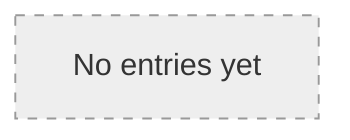

# <Bundle title>

Maintained by the agent on every structural change (see AGENTS.md,
"Ingest" workflow).

## Overview

<!-- One section per type from the taxonomy, with a link list,
     filled in by the agent during Ingest -->
